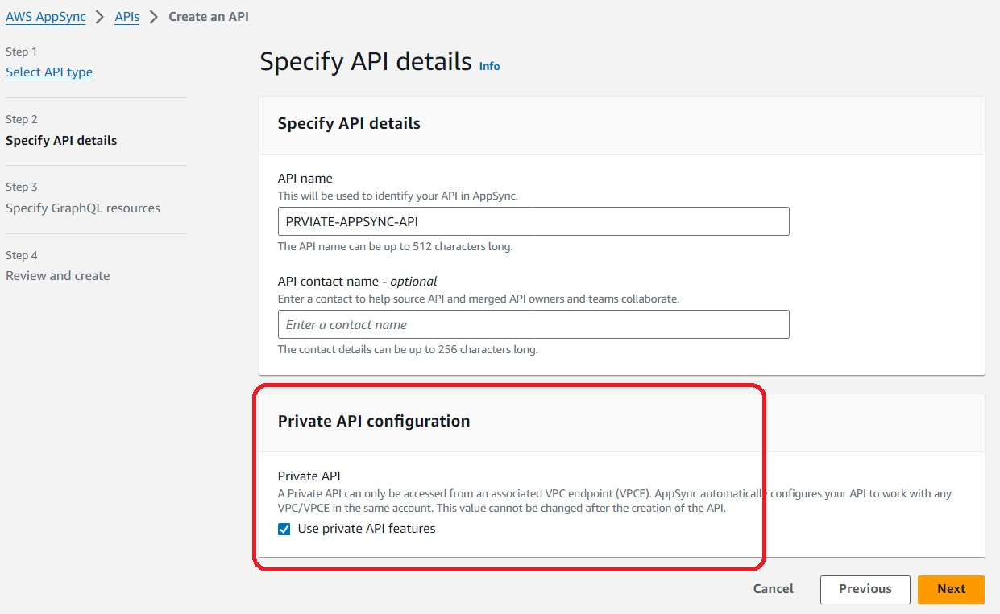

# AppSync Private API

## Solution Design


## AppSync Private API configuration

## VPC EndPoint Configuration Step

## Test AppSync GraphQL from VPC environment

Using CURL: 
```
curl -v https://<VPC Endpoint DNS Name>/graphql \
-H "Content-Type:application/graphql" \
-H "x-api-key:<AppSync Authorization API Key>" \
-H "Host:<AppSync Endpoint Host Name>" \
-d '{"query":"query {getConfig(configName:\"<param>\"){ConfigName,Value}}"}'
```

Example: 
```
curl -v https://vpce-0ce324b8f05a1ab55-kcnb4phk.appsync-api.us-west-2.vpce.amazonaws.com/graphql \
-H "Content-Type:application/graphql" \
-H "x-api-key:da2-mja54rdykfb2pnyms3pwwc66mq" \
-H "Host:rcxxxq7hrvedtioamhjjl6zuee.appsync-api.us-west-2.amazonaws.com" \
-d '{"query":"query {getConfig(ConfigName:\"TEST\"){ConfigName,Value}}"}'

```
