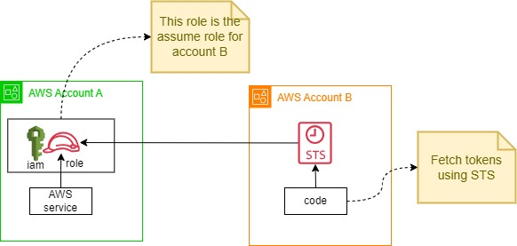

# AWS IAM Assume Role

## Introduction
AWS IAM AssumeRole is the AWS IAM feature to grant access of an AWS account service or reosource to/from Another AWS Account without sharing AWS Account root credential or any static credentials/user. It can also be stated as Cross Accounts access of AWS services. 

.

## Implementation

