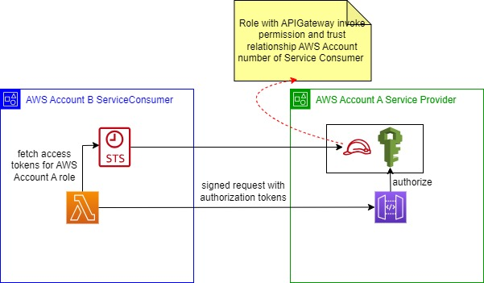

# AWS Cross Account Access to API Gateway from Lambda

## Introduction
* AWS Account A (lets name it as ServiceProvider) hosts REST API using API Gateway. 
* AWS Account B (lets name it as ServiceConsumer) has REST Client using Lambda. 
* Now Lambda hosted in ServiceConsumer account needs to access REST API hosted in ServiceProvider account with AWS IAM authorization.

## Design



## API Gateway Configuration with AWS IAM authorizer

## IAM roles configuration in ServiceProvider and ServiceConsumer

### Service Provider Account IAM Role Config
```
{
    "Version": "2012-10-17",
    "Statement": [
        {
            "Effect": "Allow",
            "Principal": {
                "AWS": "arn:aws:iam::<ServiceConsumer AWS Account Number>:root"
            },
            "Action": "sts:AssumeRole",
            "Condition": {}
        }
    ]
}
```


## Lambda RESTClient POC with Cross account authorization and Access API


## Conclusion


