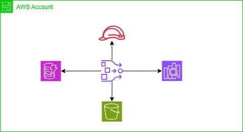

# Data Ingestion from DynamoDB to OpenSearch

## Solution Design

This is zero ETL solution provided by AWS and data ingestion happens near realtime from dynamodb to opensearch.

### Required Items  
* OpenSearch Serverless Collection
* DynamoDB Table
* S3 bucket to hold DynamoDB table content from Export 
* [IAM Role and permission having access to S3 Bucket](./iam-role-permission-policy.json)
* [Data Pipeline configuration](./data-pipeline.yml)

