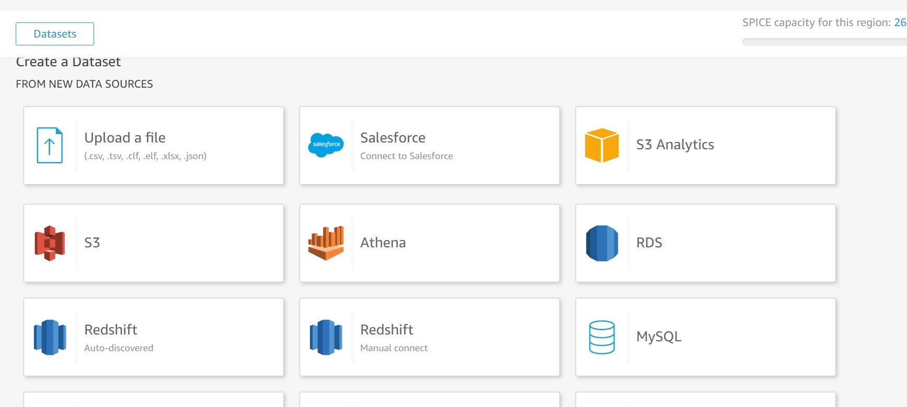
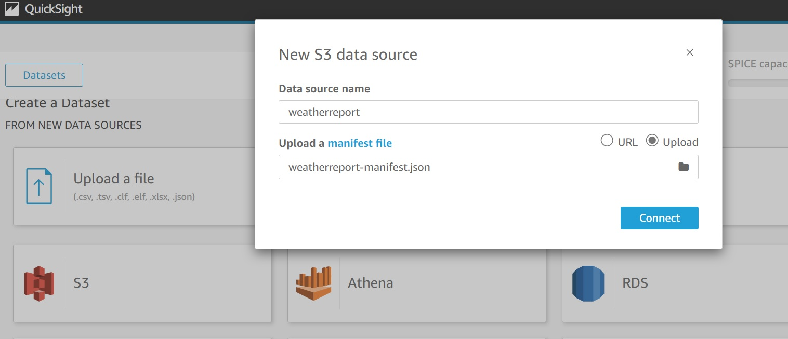
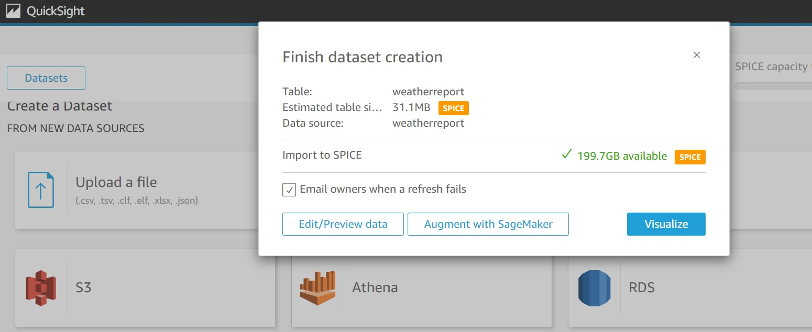
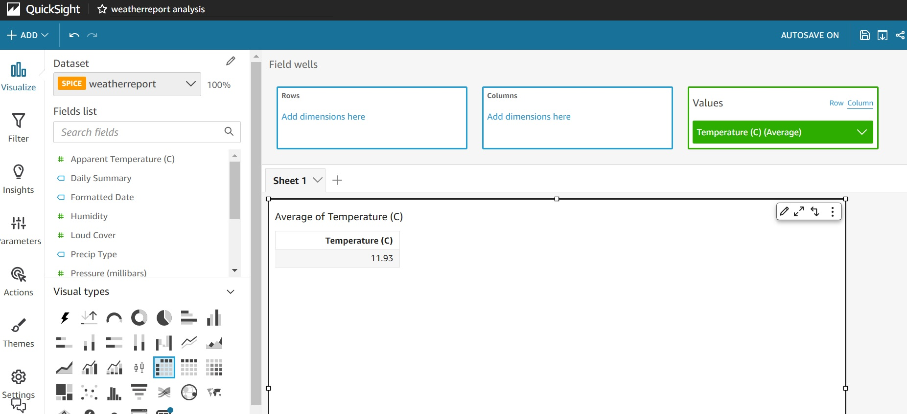
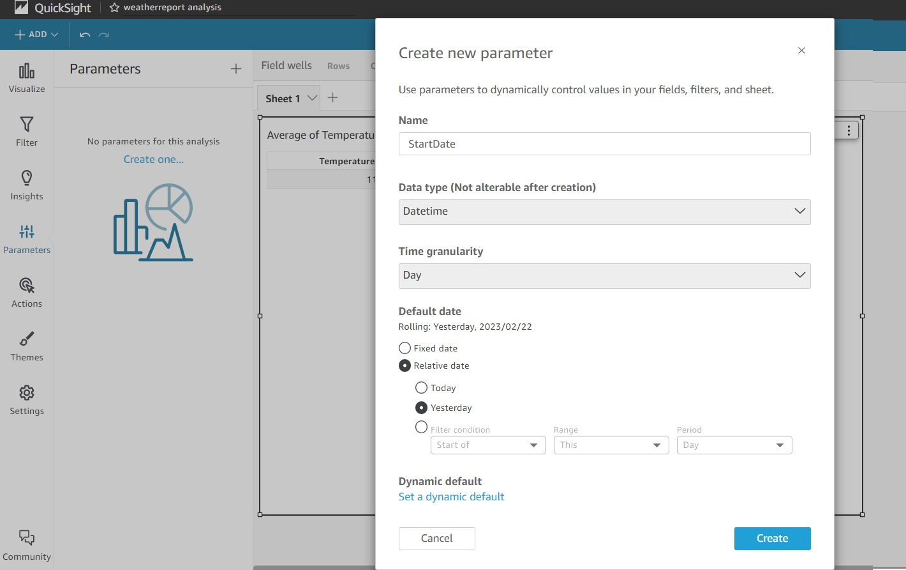
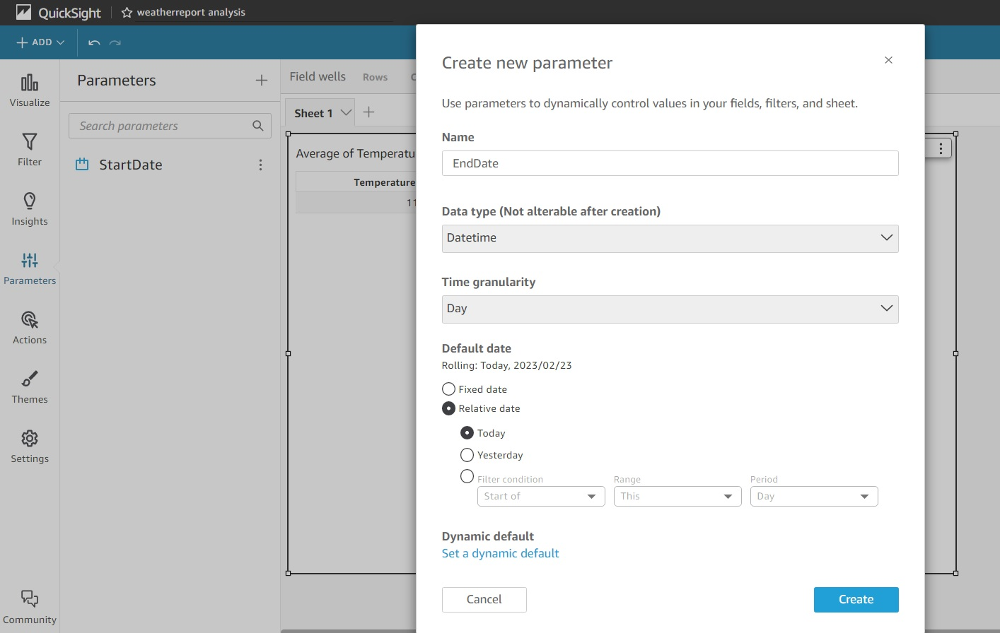
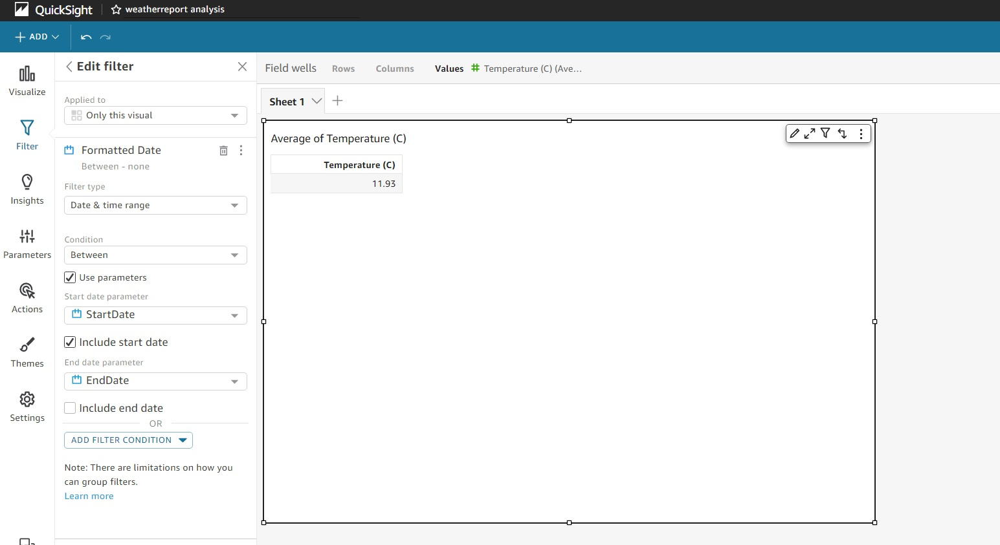
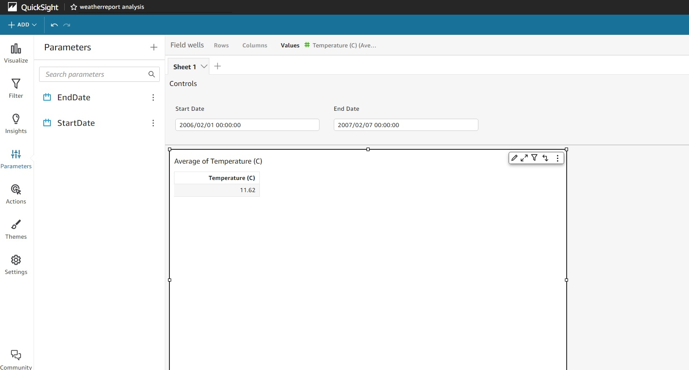
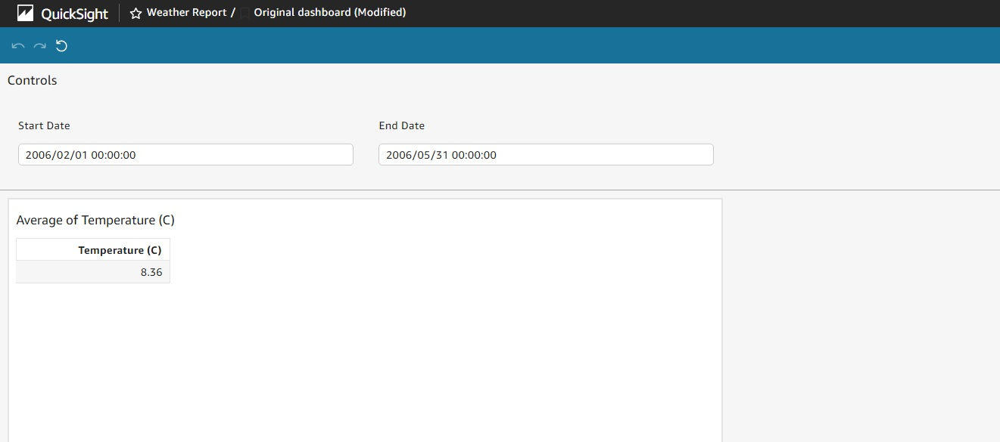

# AWS QuickSight Reports Implementation with Date Range Input Filter

##  Introduction
AWS QuickSight helps to develop analytical reports faster with great visuals for business by plugging in the data source. Here, will focus on the developing AWS QuickSight Report with Date Range Filter for user.

## Development Steps
QuickSight Report develop involves the below process:
* Creation of DataSet with data source configuration.
* Creation of analysis (report) using predefined visual available in AWS QuickSight for the DataSet created earlier.
* Publish the report as Dashboard. 
* Share the Dashboard with user for access. 

Here, our goal is to add DateRange Filter in the report visual by allowing user to select the Date Range.

For this development, used the dataset from https://www.kaggle.com/datasets/muthuj7/weather-dataset 

Below the steps:
* Create New Dataset by importing the dataset in S3. Here, I named it as daterange-dataset 
Screenshots from POC:

Sample manifest file for reference [Weather Report Manifest File](./weatherreport-manifest.json)

* Create New Analysis with the dataset created now.

* Now add Filter mapping with Start Date and End Date.

* Now add Parameter mapping to Filter. 

 

* Publish it as Dashboard  

## Conclusion
Along with Date-Range Filter, AWS QuickSight report provides the flexibility to the users to focus on the data on specific date or date0-range.